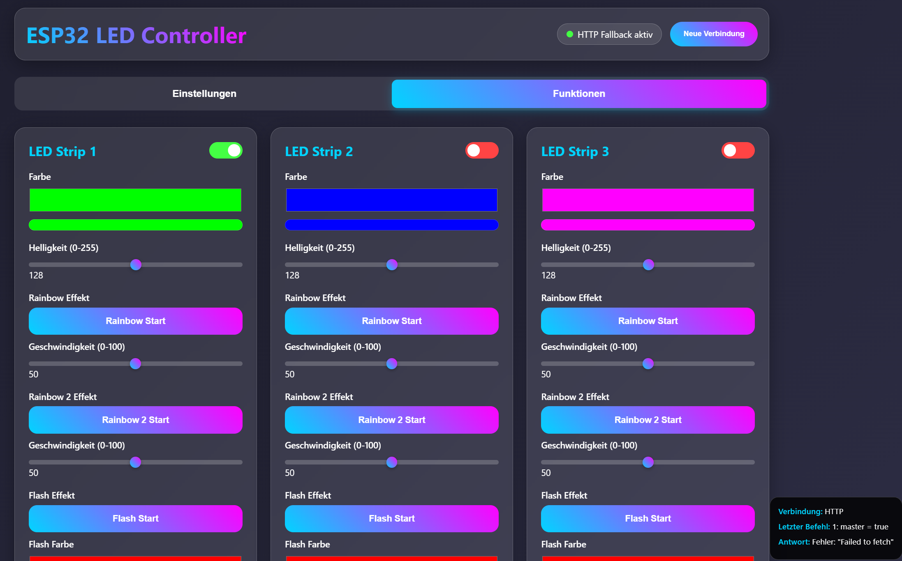

# ESP32LedControlInterface
ESP32LedControlInterface lets you control up to 3 LED strips on an ESP32 via a web interface. Supports WS2812/Neopixel LEDs with customizable effects like Rainbow, Flash, and Full Color. Configure pins, LED count, brightness, and speed directly from your browser. Perfect for DIY lighting projects!

---

## ✨ Features
- Web-based LED control interface
- Up to 3 independent LED strips
- Lighting effects:
  - Rainbow
  - Flash / Blink
  - Full static color
- Adjustable settings:
  - GPIO pin per strip
  - LED count
  - Brightness
  - Animation speed
- Runs on ESP32 Wi-Fi network

---

## 🔧 Hardware Requirements
- ESP32 development board
- WS2812 / WS2812B (Neopixel) or compatible LED strips
- 5V power supply for LEDs
- Level shifter recommended for long strips

---

## 🚀 Getting Started
1. Clone this repository
2. Open the project in Arduino IDE or PlatformIO
3. Install required libraries (see below)
4. Flash the firmware to your ESP32
5. Connect to the ESP32 Wi-Fi or check the console for assigned IP
6. Open the IP address in your browser and start controlling LEDs!

---

## 📚 Libraries Required
- FastLED *(or Adafruit NeoPixel — depending on implementation)*
- ESPAsyncWebServer
- AsyncTCP

---

## 📌 Future Improvements
- More effects and animations
- UI enhancements
- Preset saving
- MQTT / Home Assistant integration

---

## 📝 License
This project is open-source — feel free to modify and improve!

---

